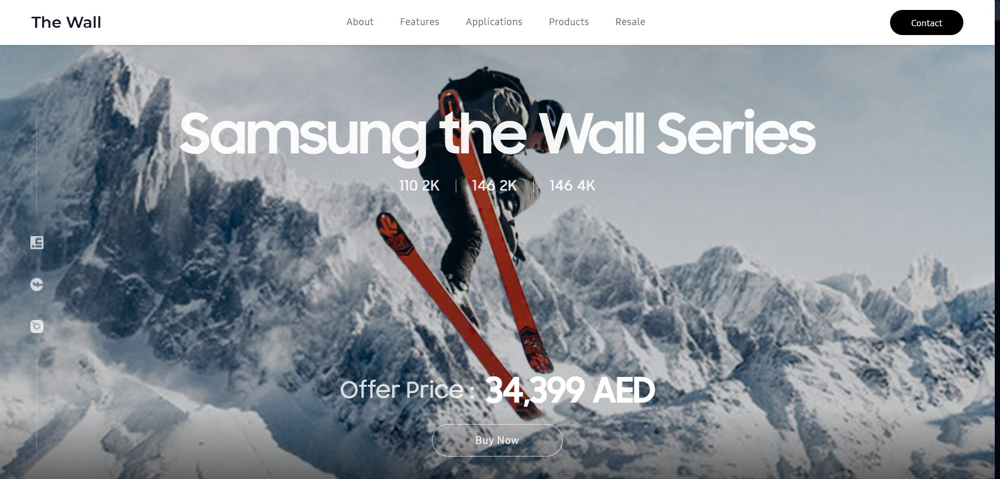
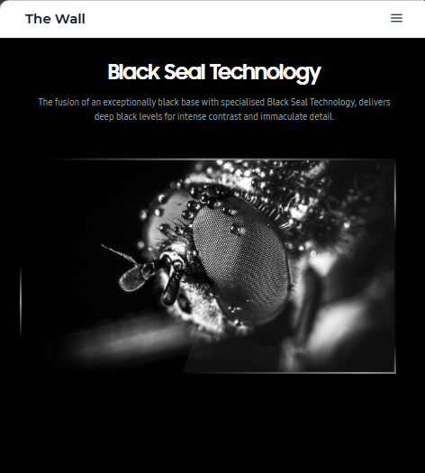
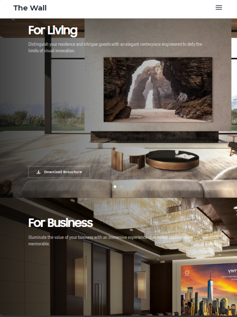
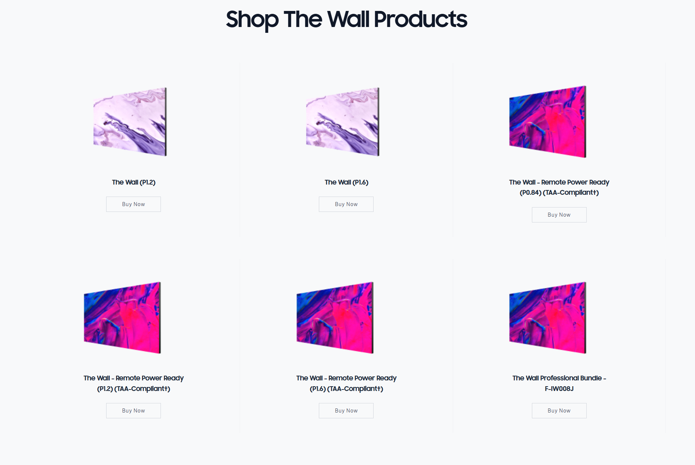
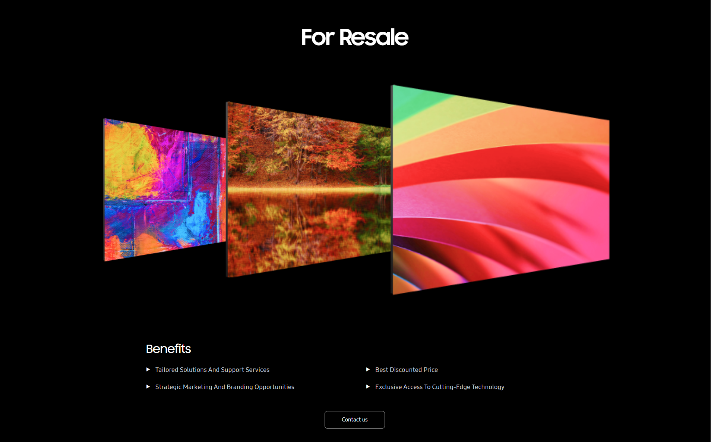
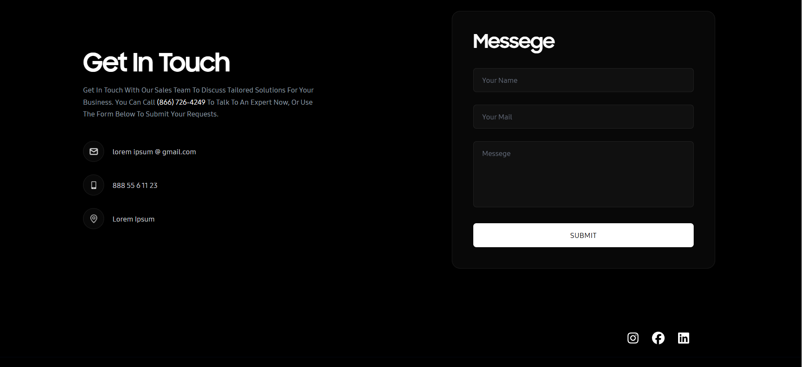

# 🌟 Samsung The Wall Landing Page

A pixel-perfect, highly responsive, high-fidelity React + Tailwind CSS implementation of the **Samsung The Wall** product landing page. Engineered based on high-end Figma designs, utilizing custom brand typography, dynamic Framer Motion animations, and visual showcase slider mechanics.

---

## 📖 Overview

This project is a high-performance frontend assignment submission modeled exactly after the custom Figma layouts for Samsung's premium **The Wall** series displays. It replicates the immersive design aesthetic of Samsung's luxury displays, translating mockups into active, responsive, modular code using modern React paradigms, clean semantic structures, and a robust global styling system.

---

## ✨ Features

*   **⚡ Responsive Hero Section**: A high-impact landscape backdrop displaying centered skier assets, vertical social sidebars with pure white vector filters, and vertical content separations that eliminate overlaps on mobile ports.
*   **📱 Responsive Navigation**: A sticky white navbar featuring Montserrat Bold branding, optimized links utilizing SamsungOne Medium, and dedicated tablet-to-mobile toggle handlers that resolve overlapping or compressed elements on portrait iPad dimensions.
*   **🔬 Technology Showcase**: Dynamic mapping arrays introducing Black Seal, Ultra Chroma, AI Upscaling, and Quantum HDR technologies in a text-above-image flow.
*   **🎛️ Interactive Technology Components**: Custom-coded scroll triggers via `IntersectionObserver` executing fades, color reveals, panel curtain sequences, and a gesture-controlled Quantum HDR comparison slider with responsive mouse and touch dragging.
*   **🏠 Application Showcase**: Spacious widescreen banners for "For Living" and "For Business" with linear text overlays, custom carousel indicator dot mounts, and responsive scaling.
*   **🖥️ Product Showcase**: Modular product showcase grids featuring alternate custom dividers and flat, borderless Buy Now action items.
*   **🧩 Explore Other Options Section**: Centered parent section holding asymmetrical card components aligned on precise title baselines using desktop-only top-padding offsets, and a shared center `"Get Quote"` CTA button below both cards.
*   **♻️ Resale Section**: A flat flex-row container (`flex items-end justify-center`) layering panel displays (`z-10`, `z-20`, `z-30`) with custom negative margins and transparent edges.
*   **🌌 Greatness In Any Space Gallery**: A responsive 12-column CSS Grid showcasing architectural portfolios with double row-span column centers and spring hover scale transitions.
*   **✉️ Contact Form**: A premium dark glassmorphic card titled **"Messege"** with detailed interactive states.
*   **🗂️ Footer Navigation**: Clean footer maps with expanding border underlines and Montserrat Medium nav trees.
*   **🎬 Framer Motion Animations**: High-fidelity spring transforms, staggered fade-ups, translation lifts, and loading indicator sequences.
*   **✒️ Samsung Typography Integration**: Complete brand cleanse purging third-party Google font files, mapping all elements to local custom fonts (`SamsungSharpSans`, `SamsungOne`, `Montserrat`) with proper weight parameters (`400`, `500`, `600`, `700`) inside `fonts.css`.
*   **✅ Form Validation**: Comprehensive inline on-blur and on-submit validator layers displaying sliding error diagnostics.
*   **🌐 Multi-device Compatibility**: Cross-device support optimized for Desktop, Tablet (iPad Portrait), and Mobile viewports.

---

## 🛠️ Tech Stack

*   **React 19** - Component-driven structural layers.
*   **Vite 8** - High-speed hot module replacement and bundle optimization.
*   **Tailwind CSS 4** - Responsive design tokens, grid utilities, and layout states.
*   **Framer Motion 11** - Hardware-accelerated transitions, gesture handling, and success states.

---

## 📸 Screenshots

### Hero Section


### Technology Section


### Applications Section


### Product Showcase


### Resale Section


### Contact Section


---

## 🚀 Installation & Setup

Follow these simple steps to set up the project locally:

1. Clone the repository into your local machine.
2. Open your terminal in the project's root folder.
3. Install all dependencies:
   ```bash
   npm install
   ```
4. Run the development server locally:
   ```bash
   npm run dev
   ```
5. Build the production-ready distribution package:
   ```bash
   npm run build
   ```
6. Preview the compiled production build locally:
   ```bash
   npm run preview
   ```

---

## 📂 Project Structure

A clean, modular directory structure keeping layout, styles, datasets, and elements organized:

```
samsung-tv/
├── README/                 # Contains screenshot visual assets
│   ├── hero.png
│   ├── technology.png
│   ├── applications.png
│   ├── products.png
│   ├── resale.png
│   └── contact.png
├── public/                 # Static public assets
└── src/
    ├── assets/             # Structured brand image directories
    │   ├── fonts/          # WOFF font files
    │   ├── hero/
    │   ├── video/
    │   ├── resale/
    │   └── space-gallery/
    ├── components/         # Premium modular React UI elements
    │   ├── Navbar.jsx
    │   ├── Hero.jsx
    │   ├── Features.jsx
    │   ├── VideoSection.jsx
    │   ├── TechnologySection.jsx
    │   ├── ApplicationSection.jsx
    │   ├── OptionCard.jsx
    │   ├── ProductCard.jsx
    │   ├── ExploreOptionCard.jsx
    │   ├── ExploreOptionsSection.jsx
    │   ├── ResaleDisplay.jsx
    │   ├── SpaceGallerySection.jsx
    │   ├── ContactSection.jsx
    │   └── FooterSection.jsx
    ├── data/               # Isolated data matrices
    │   ├── technologyData.js
    │   ├── applicationData.js
    │   └── exploreOptionsData.js
    ├── App.css
    ├── App.jsx             # Component sequence controller
    ├── fonts.css           # Custom brand @font-face rules
    ├── index.css           # Typography utilities & global styles
    └── main.jsx            # React root mount
```

---

## 📐 Responsive Design

This implementation has been fully optimized to render beautifully across all screen size tiers:
*   **Desktop ($\ge 1024px$)**: Full-fidelity widescreen alignments, 12-column grid visual galleries, and complete Navbar links with the Contact button.
*   **Tablet ($768px$ – $1023px$)**: Implements a dedicated portrait port layout that resolves compressed links and overlaps on iPad resolutions, introducing collapsible hamburger drawer menus.
*   **Mobile ($< 768px$)**: Vertical column stacking, custom container paddings to prevent sidebar overlaps, and centered text alignments.

---

## 📝 Form Validation System

The **Contact Form** contains a highly interactive, bulletproof validation framework:
*   **Required Name**: Verifies that the user input is not empty, showing warning prompts on blur and submit.
*   **Required Email**: Ensures email fields are filled.
*   **Email Format Validation**: Evaluates character structures using regex rules to prevent invalid email submission.
*   **Required Message**: Blocks empty text messages.
*   **Interactive Loading State**: Simulates server request latency (2000ms delay) during which inputs are disabled and the button morphs from `Submit` $\rightarrow$ `Sending...`.
*   **Success State**: Clears inputs on successful delivery and presents a sliding `Message Sent ✓` confirmation.

---

## 🔒 Environment Variables

No environment variables are required for this project.

---

## 🧑‍💻 Author

**Premjith P P**
*   MSc Computer Science
*   *University of Kerala*

---
